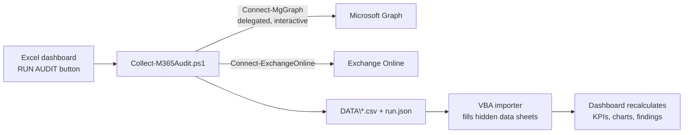

# M365 Tenant Audit Dashboard

**One-click Microsoft 365 tenant audit for M&A due diligence.**
A PowerShell collector signs in to the target tenant with a **Global Reader** account (read-only, no app registration required), gathers ~20 datasets across Entra ID, Exchange Online, SharePoint, OneDrive, Teams and Intune, and refreshes a **single-page Excel dashboard** where every KPI is a live formula — nothing is typed by hand.


> *Screenshot: `docs/dashboard-sample.png` (built from synthetic demo data)*

---

## Why this exists

When acquiring a company, you need a fast, factual picture of its Microsoft 365 tenant before integration: identities, mailboxes, activity, sharing exposure, privileged roles, licenses and devices. In practice this is usually done with scattered scripts and manual portal exports pasted into a spreadsheet.

This project turns that into a repeatable tool:

- **One workbook** (`M365_Audit_Dashboard.xlsm`) with a **RUN AUDIT** button.
- **One collector** (`Collect-M365Audit.ps1`) — interactive browser sign-in, delegated permissions, works with a plain **Global Reader** role provided by the seller.
- **100% read-only.** The tool never writes anything to the tenant.
- **Everything stays local.** Data is exported to a `DATA\` folder next to the workbook; nothing is sent anywhere else.

## How it works



The dashboard keeps a five-pillar, at-a-glance layout: **Entra | Exchange | SharePoint | Teams | Security**, plus an auto-computed **Findings** block (inactive mailboxes, external forwarding, privileged accounts without MFA, app secrets expiring soon, …).

## What it collects

| Area | Datasets |
|---|---|
| Entra ID | Users (type, enabled, licensed, guests, hybrid/cloud-only), groups, MFA registration, directory role assignments (incl. PIM-eligible when readable), enterprise apps, app registrations & credential expiry, licenses/SKUs, security defaults, Conditional Access policy counts, password policy, devices |
| Exchange Online | All recipients with size & last activity, mailbox type breakdown, shared-mailbox permissions (FullAccess / SendAs / SendOnBehalf), external forwarding, distribution groups with recursive membership, accepted domains + DKIM, transport rules, 30-day mail traffic |
| SharePoint / OneDrive | Site inventory with storage, files and activity (D90), Teams-connected vs standalone sites, tenant sharing capability, OneDrive usage per account |
| Teams | Teams with visibility and member counts, 90-day team & user activity |
| Intune | Managed devices, compliance state, last sync; cross-checked with Entra device records |

Raw CSVs are kept as evidence — useful for due-diligence documentation.

## Requirements

**On your workstation**
- Windows 10/11, Microsoft 365 desktop Excel (macros allowed, or use the macro-free `Refresh-Workbook.ps1`)
- PowerShell 7.4+ recommended (Windows PowerShell 5.1 supported)
- Modules (auto-installed, CurrentUser scope): `Microsoft.Graph`, `ExchangeOnlineManagement` ≥ 3.4

**In the target tenant (one-time, ask the seller's admin)**
1. A **Global Reader** account for you.
2. **Admin consent** for the "Microsoft Graph Command Line Tools" delegated scopes used by the collector (listed in `docs/scopes.md`) — several, like `Reports.Read.All`, are admin-consent-only.
3. Optional: uncheck **"Display concealed user, group, and site names in all reports"** (M365 admin center → Settings → Org settings → Reports). If concealment stays on, usage reports are pseudonymized and per-user joins degrade — the collector detects and reports this.
4. Optional module: an audit-read role (e.g. Purview **Audit Reader**) if you want the external file-access report.

## Quick start

```powershell
# 1. Clone and build the workbook (one-time, on your PC)
git clone https://github.com/<you>/m365-tenant-audit-dashboard.git
cd m365-tenant-audit-dashboard
.\Build-Workbook.ps1        # assembles M365_Audit_Dashboard.xlsm via Excel COM

# 2. Open M365_Audit_Dashboard.xlsm
#    Fill the Config sheet (tenant name, license unit prices, thresholds)

# 3. Click RUN AUDIT
#    Sign in with the Global Reader account when the browser opens.
#    Watch progress in the PowerShell window; the dashboard refreshes when done.
```

No tenant at hand? Try the demo:

```powershell
.\Collect-M365Audit.ps1 -SampleData .\reference\sample_data
```

then click **RUN AUDIT** — the importer picks up the generated `DATA\` files. The bundled sample data is **synthetic** (fake names, domains and figures).

## Configuration (Config sheet)

- **Tenant name** — shown in the dashboard title.
- **Activity thresholds** — Very Active ≤ 30 d, Active ≤ 90 d, Low ≤ 180 d (editable; drive the mailbox/site activity bands and the Health Score).
- **License unit prices** — monthly price per SKU. Prices are not exposed by any tenant API, so you type them once per audit; monthly/annual totals are computed by the workbook.
- **Toggles** — optional modules (deep mailbox scan, external file-access report).

## Known limits with Global Reader

Some data cannot be pulled programmatically with a plain Global Reader. The tool degrades gracefully instead of failing, and provides **manual landing sheets** (`MANUAL\` folder → `M_*` sheets):

| Data | Why | Workaround |
|---|---|---|
| Unified Audit Log (external file access) | Needs a Purview/EXO audit-read role | Optional module; or run with an audit-role account and drop the CSV in `MANUAL\` |
| Per-team channel breakdown | Channel enumeration is admin-gated in Graph | Teams admin center → Manage teams → **Export** (Global Reader can do it in the portal) |
| Per-site external-sharing flag | Not in usage reports; site settings need SP admin | Dashboard shows the tenant-level sharing setting; per-site detail via SP admin "Active sites" export |
| Defender for Endpoint device inventory (discovered/unmanaged) | MDE API needs its own roles | "Not Intune-managed" is computed from Entra vs Intune; full MDE picture via portal export |

A preflight step tests each access at runtime and reports what is available, so role-mapping changes on Microsoft's side are detected rather than assumed.

## Repository layout

```
Collect-M365Audit.ps1      # the collector (Graph + EXO, delegated, read-only)
Build-Workbook.ps1         # one-time: assembles the .xlsm on your PC (Excel COM)
Refresh-Workbook.ps1       # macro-free import fallback
M365_Audit_Dashboard.xlsx  # workbook (visuals + formulas, no macros yet)
vba/                       # VBA sources imported by Build-Workbook.ps1
reference/sample_data/     # synthetic demo exports for -SampleData
docs/                      # scopes list, screenshots, build prompt
tests/                     # offline validation (pandas + headless recalc)
DECISIONS.md               # design decisions log
```

`DATA\`, `MANUAL\` and `logs\` are created at runtime and **git-ignored** — they contain tenant data and must never be committed.

## Security & privacy

- Read-only by design: only `Get-*` cmdlets and Graph `GET` calls.
- Interactive delegated sign-in — no secrets stored, no app registration created in the target tenant.
- All output stays on your machine. Audit output contains personal data (names, emails, activity): handle it under your NDA and GDPR obligations, and never commit real tenant exports to this repository.

## Credits

- Exchange collection logic modernized from field-tested internal scripts.
- External file-access approach inspired by the o365reports.com community script (reimplemented).

## License

MIT — see [LICENSE](LICENSE).

## Disclaimer

Not affiliated with Microsoft. Role capabilities and Graph permissions evolve; the preflight checks report what your account can actually read. Use at your own risk; always validate findings before making integration decisions.
