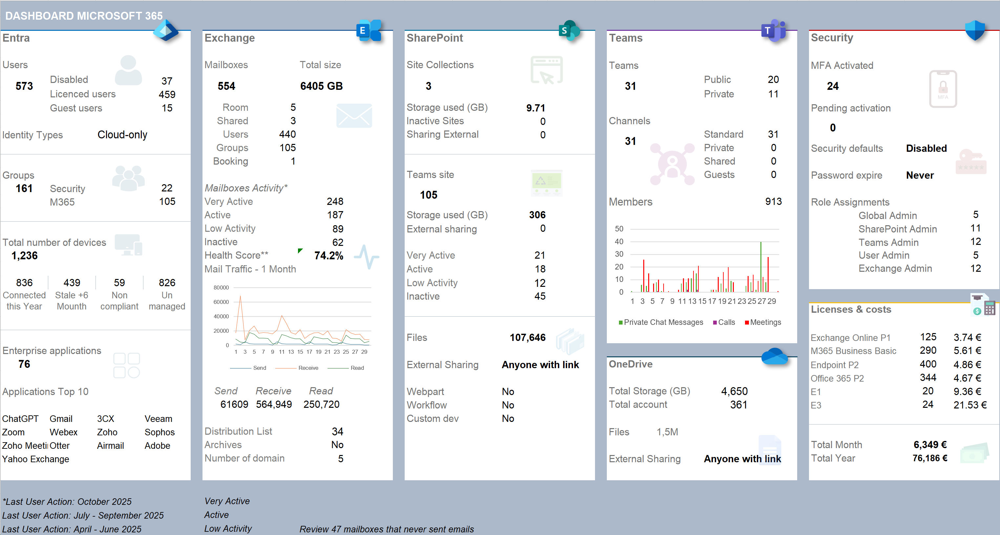
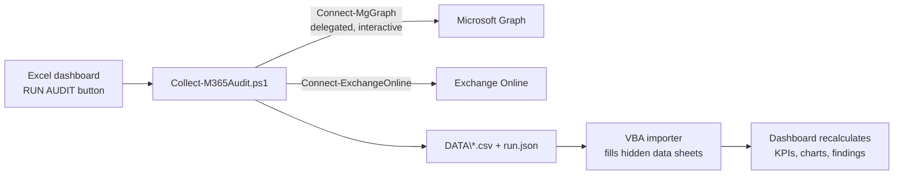

# M365 Tenant Audit Dashboard

**One-click Microsoft 365 tenant audit for M&A due diligence.**
A PowerShell collector signs in to the target tenant with a **Global Reader** account (read-only, no app registration required), gathers ~20 datasets across Entra ID, Exchange Online, SharePoint, OneDrive, Teams and Intune, and refreshes a **single-page Excel dashboard** where every KPI is a live formula — nothing is typed by hand.


> 
*Dashboard filled with synthetic demo data.*

---

## Why this exists

When acquiring a company, you need a fast, factual picture of its Microsoft 365 tenant before integration: identities, mailboxes, activity, sharing exposure, privileged roles, licenses and devices. In practice this is usually done with scattered scripts and manual portal exports pasted into a spreadsheet.

This project turns that into a repeatable tool:

- **One workbook** (`M365_Audit_Dashboard.xlsm`) with a **RUN AUDIT** button.
- **One collector** (`Collect-M365Audit.ps1`) — interactive browser sign-in, delegated permissions, works with a plain **Global Reader** role provided by the seller.
- **100% read-only.** The tool never writes anything to the tenant.
- **Everything stays local.** Data is exported to a `DATA\` folder next to the workbook; nothing is sent anywhere else.

## How it works



The dashboard keeps a five-pillar, at-a-glance layout: **Entra | Exchange | SharePoint | Teams | Security**, plus an auto-computed **Findings** block (inactive mailboxes, external forwarding, privileged accounts without MFA, app secrets expiring soon, …).

## What it collects

| Area | Datasets |
|---|---|
| Entra ID | Users (type, enabled, licensed, guests, hybrid/cloud-only), groups, MFA registration, directory role assignments (incl. PIM-eligible when readable), enterprise apps, app registrations & credential expiry, licenses/SKUs, security defaults, Conditional Access policy counts, password policy, devices |
| Exchange Online | All recipients with size & last activity, mailbox type breakdown, shared-mailbox permissions (FullAccess / SendAs / SendOnBehalf), external forwarding, distribution groups with recursive membership, accepted domains + DKIM, transport rules, 30-day mail traffic |
| SharePoint / OneDrive | Site inventory with storage, files and activity (D90), Teams-connected vs standalone sites, tenant sharing capability, OneDrive usage per account |
| Teams | Teams with visibility and member counts, 90-day team & user activity |
| Intune | Managed devices, compliance state, last sync; cross-checked with Entra device records |

Raw CSVs are kept as evidence — useful for due-diligence documentation.

## Requirements

**On your workstation**
- Windows 10/11, Microsoft 365 desktop Excel (macros allowed, or use the macro-free path below)
- PowerShell 7.4+ recommended (Windows PowerShell 5.1 supported)
- Internet access. The first run installs two modules for the current user: `Microsoft.Graph.Authentication` and `ExchangeOnlineManagement` (3.4 or newer)

**In the target tenant (one-time, ask the seller's admin)**
1. A **Global Reader** account for you.
2. **Admin consent** for the "Microsoft Graph Command Line Tools" delegated scopes used by the collector — several, like `Reports.Read.All`, are admin-consent-only. Easiest way: a Global Admin of the target tenant runs `Collect-M365Audit.ps1` once and ticks **"Consent on behalf of your organization"** on the sign-in consent page.

   > User.Read.All, Group.Read.All, GroupMember.Read.All, Directory.Read.All,
   > Organization.Read.All, Application.Read.All, Policy.Read.All,
   > Reports.Read.All, ReportSettings.Read.All, AuditLog.Read.All,
   > UserAuthenticationMethod.Read.All, Device.Read.All,
   > DeviceManagementManagedDevices.Read.All, RoleManagement.Read.Directory,
   > Domain.Read.All, SharePointTenantSettings.Read.All, Team.ReadBasic.All

3. Optional: untick **"Display concealed user, group, and site names in all reports"** (M365 admin center → Settings → Org settings → Reports). If concealment stays on, usage reports are pseudonymized and per-user joins degrade — the collector detects and reports this.
4. Optional module: an audit-read role (e.g. **View-Only Audit Logs**) if you want the external file-access report.

## Unblock the files (first time only)

Windows tags everything downloaded from the internet — the GitHub ZIP included — with a "Mark of the Web". Excel then refuses to run the macros and shows a red banner: *"Microsoft has blocked macros from running because the source of this file is untrusted"*. PowerShell may refuse the scripts for the same reason.

Easiest fix — unblock the ZIP **before** extracting it:

1. Right-click the downloaded ZIP → **Properties**.
2. On the General tab, tick **Unblock** → **OK**.
3. Extract. Every extracted file is then trusted.

Already extracted? Unblock everything in place (PowerShell, run from the audit folder):

```powershell
Get-ChildItem -Recurse | Unblock-File
```

Alternative: add the audit folder as a Trusted Location in Excel (File → Options → Trust Center → Trust Center Settings → Trusted Locations → Add new location). If the banner offers no way out even after unblocking, your organization blocks macros by policy: use the macro-free path below.

Reference: Microsoft, ["A potentially dangerous macro has been blocked"](https://support.microsoft.com/en-us/topic/a-potentially-dangerous-macro-has-been-blocked-0952faa0-37e7-4316-b61d-5b5ed6024216).

## Quick start

1. Download the release ZIP (or clone), unblock it, extract it to a **local** folder (avoid OneDrive-synced folders — slower, and Excel re-stamps cloud paths into the file).
2. Open `M365_Audit_Dashboard.xlsm`, enable macros.
3. On the **Config** sheet: tenant name, activity thresholds, and your license unit prices (the only thing you ever type by hand — prices exist in no tenant API).
4. Click **RUN AUDIT** on the Dashboard.
5. A PowerShell window opens; sign in twice in the browser (Microsoft Graph, then Exchange Online) with the Global Reader account.
6. Wait — a typical 600-mailbox tenant takes 10–20 minutes. Progress shows in the PowerShell window; Excel shows elapsed time in the status bar (press ESC in Excel to stop waiting — the collector keeps running and you can import later with Alt+F8 → `ImportAll`).
7. When it finishes, the workbook imports everything and shows a summary. Check the **RunInfo** sheet for per-dataset status and warnings.

Run it again any time: `DATA\` is overwritten, the dashboard refreshes, nothing accumulates.

### Optional manual exports (Global Reader cannot fetch these by API)

Export from the portals (the Global Reader account can open them all), save the CSV in `MANUAL\` with the exact name, then RUN AUDIT again or run `Refresh-Workbook.ps1`:

| File in `MANUAL\` | Where to export | Feeds |
|---|---|---|
| `TeamsAdminExport.csv` | Teams admin center → Teams → Manage teams → Export | Channels block (Standard/Private/Shared, Guests) |
| `SPAdminSites.csv` | SharePoint admin center → Active sites → Export | Per-site external sharing |
| `MDE_Devices.csv` | security.microsoft.com → Assets → Devices → Export | "Discovered by MDE (unmanaged)" line |
| `ExternalFileAccess.csv` | Optional collector module (audit role needed) | M_ExternalFileAccess sheet |
| `ITCosts.csv` | Your own cost table (free format) | M_ITCosts sheet |

You can also paste rows directly into the matching `M_*` sheet.

### If macros are blocked on your PC

1. Run the collector yourself: `powershell -ExecutionPolicy Bypass -File Collect-M365Audit.ps1 -OutputPath .\DATA`
2. Close the workbook, then run `powershell -ExecutionPolicy Bypass -File Refresh-Workbook.ps1` (opens the closed workbook in a hidden Excel, imports, saves).
3. Open the workbook and read the dashboard.

## Collector options

```
Collect-M365Audit.ps1
    -OutputPath <folder>          where to write DATA (default: .\DATA)
    -SkipExchange                 Graph only
    -SkipGraph                    Exchange only
    -DeepMailboxScan              exact LastEmailSent/Received per mailbox
                                  (2 extra calls per mailbox — slow). Default:
                                  fast estimate from the 90-day email report
    -IncludeExternalFileAccess    external file access report (audit role needed)
    -UserPrincipalName <upn>      account for the Exchange sign-in
    -SampleData <folder>          offline test mode (no tenant needed)
```

The Config toggles (deep scan, external file access) are passed automatically by the RUN AUDIT button.

## Known limits with Global Reader

The tool degrades gracefully instead of failing — a blocked dataset never aborts the run:

| Data | Why blocked | What the tool does |
|---|---|---|
| Unified Audit Log (external file access) | Needs a Purview/EXO audit-read role, not in Global Reader | Optional module, off by default; the collector tests access first. Else: collect with an audit-role account, drop the CSV in `MANUAL\` |
| Per-team channel breakdown | Channel enumeration is admin-gated in Graph | Channels block reads `MANUAL\TeamsAdminExport.csv` |
| Per-site external-sharing flag | Not in usage reports; needs SP admin or app permissions | Dashboard shows the tenant-level sharing setting; per-site detail via `MANUAL\SPAdminSites.csv` |
| Defender for Endpoint device inventory | The MDE machine API needs its own roles | "Not Intune-managed" computed from Entra vs Intune; full MDE picture via `MANUAL\MDE_Devices.csv` |

A preflight step tests each access at runtime and reports what is actually available, so Microsoft-side role changes are detected rather than assumed. Also note: user `signInActivity` needs an Entra ID P1 license in the target tenant, so the tool does not depend on it — mailbox and device activity dates are used instead.

## Repository layout

```
M365_Audit_Dashboard.xlsm  # the dashboard with the RUN AUDIT button
M365_Audit_Dashboard.xlsx  # same workbook without macros (macro-free path)
Collect-M365Audit.ps1      # the collector (Graph + EXO, delegated, read-only)
Refresh-Workbook.ps1       # macro-free import into the closed workbook
Build-Workbook.ps1         # rebuilds the .xlsm from the .xlsx + vba/ (Excel COM)
vba/                       # VBA sources (modAudit.bas, modImport.bas)
tools/                     # workbook builder (Python; needs the private reference/)
tests/                     # offline validation suite
docs/                      # screenshots
DECISIONS.md               # design decisions log
```

Created at runtime and **git-ignored**: `DATA\`, `MANUAL\`, `logs\` (tenant data — never committed). The `reference\` folder (validated template and engagement sample exports) is private and not part of the repository.

## Testing without a tenant

```powershell
powershell -ExecutionPolicy Bypass -File Collect-M365Audit.ps1 -SampleData ..\reference\sample_data -OutputPath .\DATA
```

transforms sample exports into a full `DATA\` set (needs the ImportExcel module, installed automatically), then load with `Refresh-Workbook.ps1` or the `ImportAll` macro (Alt+F8). This needs a local `sample_data` folder with the expected export formats — the original engagement data stays private, so bring your own or a synthetic set. Full automated suite: `python tests\validate.py`.

## Rebuilding the workbook (only after changing the tool)

1. `python tools\build_workbook.py` — rebuilds `M365_Audit_Dashboard.xlsx` from the validated template (private `reference/template`, not in the repo).
2. `powershell -ExecutionPolicy Bypass -File Build-Workbook.ps1` — imports the VBA and saves the `.xlsm`. One-time Excel setting: File → Options → Trust Center → Trust Center Settings → Macro Settings → tick **"Trust access to the VBA project object model"**.

## Security & privacy

- Read-only by design: only `Get-*` cmdlets and Graph `GET` calls.
- Interactive delegated sign-in — no secrets stored, no app registration created in the target tenant.
- All output stays on your machine. `DATA\`, `MANUAL\` and `logs\` contain personal data from the audited tenant (names, emails, activity): keep them local, handle them under your NDA and GDPR obligations, never commit them.

## Troubleshooting

| Symptom | Fix |
|---|---|
| Sign-in fails with a consent error (AADSTS65001) | The one-time admin consent is missing — see Requirements point 2 |
| "Missing Graph scopes" warning at start | Same cause: a Global Admin must consent once to the listed scopes |
| A dataset shows FAIL on RunInfo | Read the Message column and `logs\collector_*.log`; the rest of the dashboard still works — fix and rerun |
| Usage reports show hashed names, per-user joins empty | Untick "Display concealed names" (Requirements point 3) and rerun |
| "Header mismatch" on RunInfo | The CSV comes from a different tool version — rerun the collector shipped with this workbook |
| MFA / Conditional Access lines empty | The account could not read those policies — check it really holds Global Reader |
| RUN AUDIT does nothing | Macros blocked by the Mark of the Web — see "Unblock the files" above, or use the macro-free path |
| "Running scripts is disabled on this system" | Launch with `powershell -ExecutionPolicy Bypass -File ...` as shown in every command above |
| Run-time error 52 on RUN AUDIT (older build) | Workbook opened from OneDrive/SharePoint; current builds map the URL to the local synced folder — if that fails, copy the folder to a local disk (e.g. `C:\Audit`) |
| Excel shows `#####` in a cell | Column too narrow at your zoom level; the value is fine |
| The collector is slow on mailboxes | Normal: one statistics call per mailbox. Avoid `-DeepMailboxScan` unless you need exact last-email dates |

## Credits

- Exchange collection logic modernized from field-tested internal scripts.
- External file-access approach inspired by the o365reports.com community script (reimplemented).

## License

MIT — see [LICENSE](LICENSE).

## Disclaimer

Not affiliated with Microsoft. Role capabilities and Graph permissions evolve; the preflight checks report what your account can actually read. Use at your own risk; always validate findings before making integration decisions.
